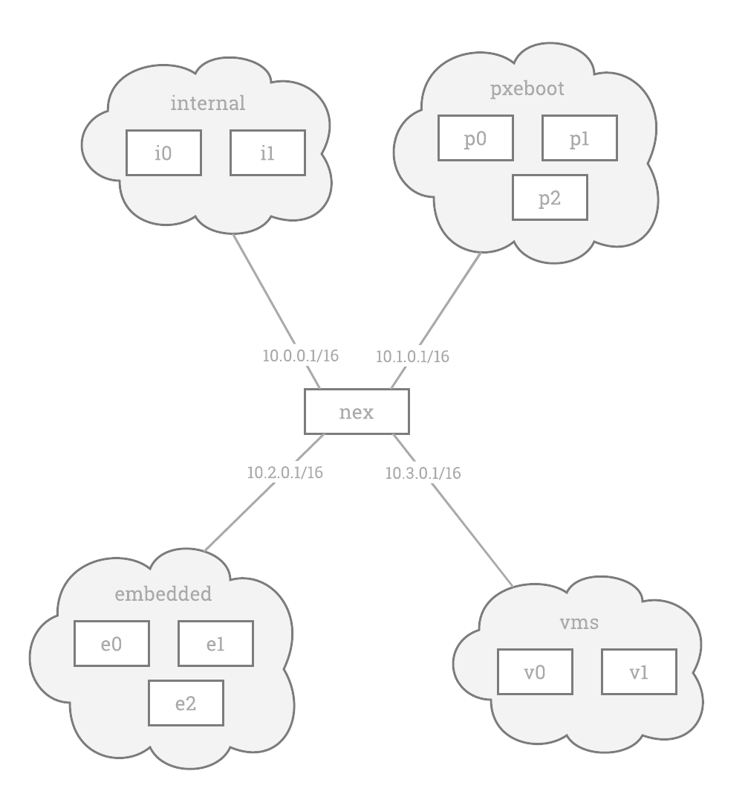

# Basic Multi-Net Test

This test involves 3 networks as depicted in the diagram below

.

Each network is defined in the [configuration file](../config/net0.yml) associated with this test case.

The tests are defined using the [avocado testing framework](https://avocado-framework.github.io/) and are defined in the python scripts in this directory.

The basic idea of the tests are to make sure that DHCP and dns are working as expected.

